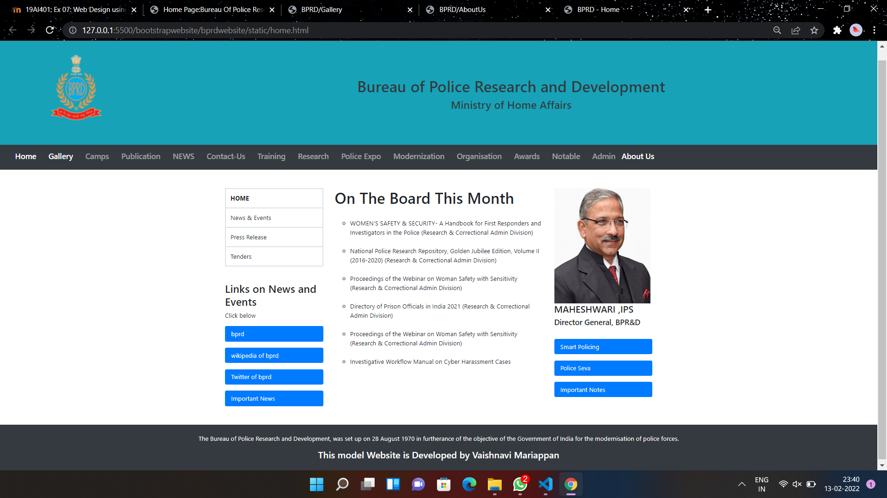
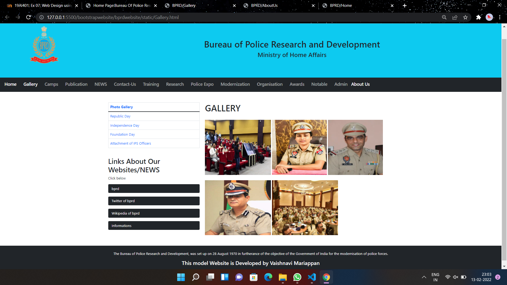
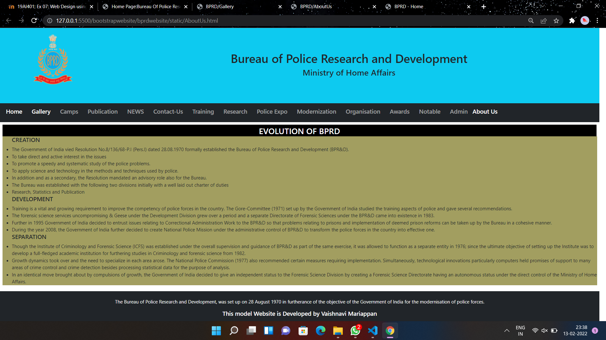

# Web Design using Bootstrap Framework

## AIM:
To design a website using bootstrap framework.

## DESIGN STEPS:

### Step 1:

Requirement collection.

### Step 2:

Creating the layout using bootstrap grid system.

### Step 3:

Updating the sample content.

### Step 4:

Choose the appropriate style and color scheme.

### Step 5:

Validate the layout in various browsers.

### Step 6:

Validate the HTML code.

### Step 6:

Publish the website in the given URL.

## PROGRAM :
### Home.html:
```
<!DOCTYPE html>
<html lang="en">
<head>
  <title>BPRD - Home</title>
  <meta charset="utf-8">
  <meta name="viewport" content="width=device-width, initial-scale=1">
  <link rel="stylesheet" href="https://maxcdn.bootstrapcdn.com/bootstrap/4.0.0/css/bootstrap.min.css" integrity="sha384-Gn5384xqQ1aoWXA+058RXPxPg6fy4IWvTNh0E263XmFcJlSAwiGgFAW/dAiS6JXm" crossorigin="anonymous">
  <script src="https://code.jquery.com/jquery-3.2.1.slim.min.js" integrity="sha384-KJ3o2DKtIkvYIK3UENzmM7KCkRr/rE9/Qpg6aAZGJwFDMVNA/GpGFF93hXpG5KkN" crossorigin="anonymous"></script>
<script src="https://cdnjs.cloudflare.com/ajax/libs/popper.js/1.12.9/umd/popper.min.js" integrity="sha384-ApNbgh9B+Y1QKtv3Rn7W3mgPxhU9K/ScQsAP7hUibX39j7fakFPskvXusvfa0b4Q" crossorigin="anonymous"></script>
<script src="https://maxcdn.bootstrapcdn.com/bootstrap/4.0.0/js/bootstrap.min.js" integrity="sha384-JZR6Spejh4U02d8jOt6vLEHfe/JQGiRRSQQxSfFWpi1MquVdAyjUar5+76PVCmYl" crossorigin="anonymous"></script>
  <style>
  .fakeimg {
    height: 200px;
    background: #aaa;
  }
  </style>
</head>
<body>
    <div class="p-4 bg-info text-dark text-center">
        <div class="row">
            <div class="col-sm-2">
                
            </div>
        <div class="col-sm-10">    
        <div class="p-4 bg-info text-dark text-center">
        </br>
      </br>
    </br>
        <h1>Bureau of Police Research and Development</h1>
        <h3>Ministry of Home Affairs</h3> 
        </div>
        </div>
        </div>
    </div>

    <nav class="navbar navbar-expand-sm bg-dark navbar-dark">
        <div class="container-fluid">
          <ul class="navbar-nav">
              <li class="nav-item">
                  <h5 class="nav-link active" href="/static/home.html">Home</h5>
                </li>
                <li class="nav-item">
                  <a class="nav-link" href="#"></a>
                </li>
                <li class="nav-item">
                  <h5 class="nav-link active" href="/static/Gallery.html">Gallery</h5>
                </li>
                <li class="nav-item">
                  <a class="nav-link" href="#"></a>
                </li>
                <li class="nav-item">
                  <h5 class="nav-link" href="#">Camps</h5>
                </li>
                <li class="nav-item">
                  <a class="nav-link" href="#"></a>
                </li>
                <li class="nav-item">
                  <h5 class="nav-link" href="#">Publication</h5>
                </li>
                <li class="nav-item">
                  <a class="nav-link" href="#"></a>
                </li>
                <li class="nav-item">
                  <h5 class="nav-link" href="#">NEWS</h5>
                </li>
                <li class="nav-item">
                  <a class="nav-link" href="#"></a>
                </li>
                <li class="nav-item">
                  <h5 class="nav-link" href="#">Contact-Us</h5>
                </li>
                <li class="nav-item">
                  <a class="nav-link" href="#"></a>
                </li>
                <li class="nav-item">
                  <h5 class="nav-link" href="#">Training</v>
                </li>
                <li class="nav-item">
                  <a class="nav-link" href="#"></a>
                </li>
                <li class="nav-item">
                  <h5 class="nav-link" href="#">Research</h5>
                </li> <li class="nav-item">
                  <a class="nav-link" href="#"></a>
                </li>
                <li class="nav-item">
                  <h5 class="nav-link" href="#">Police Expo</h5>
                </li>
                <li class="nav-item">
                  <a class="nav-link" href="#"></a>
                </li>
                <li class="nav-item">
                  <h5 class="nav-link" href="#">Modernization</h5>
                </li>
                <li class="nav-item">
                  <a class="nav-link" href="#"></a>
                </li>
                <li class="nav-item">
                  <h5 class="nav-link" href="#">Organisation</h5>
                </li>
                <li class="nav-item">
                  <a class="nav-link" href="#"></a>
                </li>
                <li class="nav-item">
                  <h5 class="nav-link" href="#">Awards</h5>
                </li>
                <li class="nav-item">
                  <a class="nav-link" href="#"></a>
                </li>
                <li class="nav-item">
                  <h5 class="nav-link" href="#">Notable</h5>
                </li>
                <li class="nav-item">
                  <a class="nav-link" href="#"></a>
                </li>
                <li class="nav-item">
                  <h5 class="nav-link" href="#">Admin</h5>
                </li>
                <li class="nav-item">
                  <h5 class="nav-link active" href="/static/AboutUs.html">About Us</h5>
                </li>
          </ul>
        </div>
      </nav>

<div class="container mt-5">
  <div class="row">
    <div class="col-sm-3">
        <table class="table table-bordered">
            <thead>
              <tr>
                <th class="nav-link active">HOME</th>
              </tr>
            </thead>
            <tbody>
              <tr>
                <td class="nav-link active">News & Events</td>
              </tr>
              <tr>
                <td class="nav-link active">Press Release</td>
              </tr>
              <tr>
                <td class="nav-link active">Tenders</td>
              </tr>
            </tbody>
          </table>
          <ul class="nav nav-pills flex-column">
            <li class="nav-item">
                <h3 class="mt-4">Links on News and Events</h3>
                <p>Click below</p>
                <a class="nav-link active" href="https://bprd.nic.in/">bprd</a>
              </li>
              <li class="nav-item">
                <a class="nav-link" href="#"></a>
              </li>
              <li class="nav-item">
                <a class="nav-link active" href="https://en.wikipedia.org/wiki/Bureau_of_Police_Research_and_Development">wikipedia of bprd</a>
              </li>
              <li class="nav-item">
                <a class="nav-link" href="#"></a>
              </li>
              <li class="nav-item">
                <a class="nav-link active" href="https://twitter.com/bprdindia?lang=en">Twitter of bprd</a>
              </li>
              <li class="nav-item">
                <a class="nav-link" href="#"></a>
              </li>
              <li class="nav-item">
                <a class="nav-link active" href="https://economictimes.indiatimes.com/topic/bureau-of-police-research-and-development">Important News</a>
              </li>
          </ul>
          <hr class="d-sm-none">
        </div>
    <div class="col-sm-6">
        <h1>On The Board This Month</h1><br/>
        <ul type="circle">
            <li>WOMEN’S SAFETY & SECURITY- A Handbook for First Responders and Investigators in the Police (Research & Correctional Admin Division)</li>
            <br/>
            <li>National Police Research Repository, Golden Jubilee Edition, Volume II (2016-2020) (Research & Correctional Admin Division) </li>
            <br/>
            <li>Proceedings of the Webinar on Woman Safety with Sensitivity (Research & Correctional Admin Division) </li>
            <br/>
            <li>Directory of Prison Officials in India 2021 (Research & Correctional Admin Division) </li>
            <br/>
            <li>Proceedings of the Webinar on Woman Safety with Sensitivity (Research & Correctional Admin Division)</li>
            <br/>
            <li>Investigative Workflow Manual on Cyber Harassment Cases</li>
        </ul>
      
    </div>
    <div class="col-sm-3">
        
        <h4>MAHESHWARI ,IPS</h4>
        <h5>Director General, BPR&D</h5>
        <br/>
        <ul class="nav nav-pills flex-column">
            <li class="nav-item">
                <a class="nav-link active">Smart Policing</a>
            </li>
            <li class="nav-item">
                <a class="nav-link" href="#"></a>
              </li>
            <li class="nav-item">
                <a class="nav-link active">Police Seva</a>
            </li>
            <li class="nav-item">
                <a class="nav-link" href="#"></a>
              </li>
            <li class="nav-item">
                <a class="nav-link active">Important Notes</a>
            </li>
    </div>
  </div>
</div>

<div class="mt-5 p-4 bg-dark text-white text-center">
    <p>The Bureau of Police Research and Development, was set up on 28 August 1970 in furtherance of the objective of the Government of India for the modernisation of police forces.</p>
    <h4>This model Website is Developed by Vaishnavi Mariappan</h4>
</div>

</body>
</html>
```
### AboutUS.html:
```
<!DOCTYPE html>
<html lang="en">
<head>
  <title>BPRD/AboutUs</title>
  <meta charset="utf-8">
  <meta name="viewport" content="width=device-width, initial-scale=1">
  <link href="https://cdn.jsdelivr.net/npm/bootstrap@5.1.3/dist/css/bootstrap.min.css" rel="stylesheet">
  <script src="https://cdn.jsdelivr.net/npm/bootstrap@5.1.3/dist/js/bootstrap.bundle.min.js"></script>
  <style>
  .fakeimg {
    height: 300px;
    background: rgb(180, 69, 69);
  }
  </style>
</head>
<body>
    <div class="p-4 bg-info text-dark text-center">
        <div class="row">
            <div class="col-sm-2">
                
            </div>
        <div class="col-sm-10">    
        <div class="p-4 bg-info text-dark text-center">
        </br>
    </br>
</br>
        <h1>Bureau of Police Research and Development</h1>
        <h3>Ministry of Home Affairs</h3> 
        </div>
        </div>
        </div>
    </div>

<nav class="navbar navbar-expand-sm bg-dark navbar-dark">
    <div class="container-fluid">
      <ul class="navbar-nav">
          <li class="nav-item">
              <h5 class="nav-link active" href="/static/home.html">Home</h5>
            </li>
            <li class="nav-item">
              <a class="nav-link" href="#"></a>
            </li>
            <li class="nav-item">
              <h5 class="nav-link active" href="static/Gallery.html">Gallery</h5>
            </li>
            <li class="nav-item">
              <a class="nav-link" href="#"></a>
            </li>
            <li class="nav-item">
              <h5 class="nav-link" href="#">Camps</h5>
            </li>
            <li class="nav-item">
              <a class="nav-link" href="#"></a>
            </li>
            <li class="nav-item">
              <h5 class="nav-link" href="#">Publication</h5>
            </li>
            <li class="nav-item">
              <a class="nav-link" href="#"></a>
            </li>
            <li class="nav-item">
              <h5 class="nav-link" href="#">NEWS</h5>
            </li>
            <li class="nav-item">
              <a class="nav-link" href="#"></a>
            </li>
            <li class="nav-item">
              <h5 class="nav-link" href="#">Contact-Us</h5>
            </li>
            <li class="nav-item">
              <a class="nav-link" href="#"></a>
            </li>
            <li class="nav-item">
              <h5 class="nav-link" href="#">Training</v>
            </li>
            <li class="nav-item">
              <a class="nav-link" href="#"></a>
            </li>
            <li class="nav-item">
              <h5 class="nav-link" href="#">Research</h5>
            </li> <li class="nav-item">
              <a class="nav-link" href="#"></a>
            </li>
            <li class="nav-item">
              <h5 class="nav-link" href="#">Police Expo</h5>
            </li>
            <li class="nav-item">
              <a class="nav-link" href="#"></a>
            </li>
            <li class="nav-item">
              <h5 class="nav-link" href="#">Modernization</h5>
            </li>
            <li class="nav-item">
              <a class="nav-link" href="#"></a>
            </li>
            <li class="nav-item">
              <h5 class="nav-link" href="#">Organisation</h5>
            </li>
            <li class="nav-item">
              <a class="nav-link" href="#"></a>
            </li>
            <li class="nav-item">
              <h5 class="nav-link" href="#">Awards</h5>
            </li>
            <li class="nav-item">
              <a class="nav-link" href="#"></a>
            </li>
            <li class="nav-item">
              <h5 class="nav-link" href="#">Notable</h5>
            </li>
            <li class="nav-item">
              <a class="nav-link" href="#"></a>
            </li>
            <li class="nav-item">
              <h5 class="nav-link" href="#">Admin</h5>
            </li>
            <li class="nav-item">
              <h5 class="nav-link active" href="/static/AboutUs.html">About Us</h5>
            </li>
      </ul>
    </div>
  </nav>


  <div class="panel panel-default order-2 p-2  bd-highlight" style="height: 500px;">
    <div class="panel-heading text-white text-center pt-1" style="height: 40px;width: 2008px;background-color:black;">
        <h3>EVOLUTION OF BPRD</h3>
    </div>
    <div class="panel-body">
        <ul style="background-color: rgba(117, 111, 18, 0.671);">
            <h5> CREATION</h5>
            <li> The Government of India vied Resolution No.8/136/68-P.I (Pers.I) dated 28.08.1970 formally established the Bureau of Police Research and Development (BPR&D).</li>
            
            <li> To take direct and active interest in the issues</li>
            
            <li> To promote a speedy and systematic study of the police problems.</li>
            
            <li> To apply science and technology in the methods and techniques used by police.</li>
            
            <li> In addition and as a secondary, the Resolution mandated an advisory role also for the Bureau.</li>
    
            <li> The Bureau was established with the following two divisions initially with a well laid out charter of duties</li>
             
            <li> Research, Statistics and Publication</li>
            
            <h5> DEVELOPMENT</h5>
            
            <li> Training is a vital and growing requirement to improve the competency of police forces in the country. The Gore-Committee (1971) set up by the Government of India studied the training aspects of police and gave several recommendations.</li>
            
            <li> The forensic science services uncompromising & Geese under the Development Division grew over a period and a separate Directorate of Forensic Sciences under the BPR&D came into existence in 1983.</li>
            
            <li> Further in 1995 Government of India decided to entrust issues relating to Correctional Administration Work to the BPR&D so that problems relating to prisons and implementation of deemed prison reforms can be taken up by the Bureau in a cohesive manner.</li>
            
            <li> During the year 2008, the Government of India further decided to create National Police Mission under the administrative control of BPR&D to transform the police forces in the country into effective one.</li>
            
            <h5>SEPARATION</h5>
            
            <li> Though the Institute of Criminology and Forensic Science (ICFS) was established under the overall supervision and guidance of BPR&D as part of the same exercise, it was allowed to function as a separate entity in 1976; since the ultimate objective of setting up the Institute was to develop a full-fledged academic institution for furthering studies in Criminology and forensic science from 1982.</li>
            
            <li> Growth dynamics took over and the need to specialize in each area arose. The National Police Commission (1977) also recommended certain measures requiring implementation. Simultaneously, technological innovations particularly computers held promises of support to many areas of crime control and crime detection besides processing statistical data for the purpose of analysis.</li>
            
            <li> In an identical move brought about by compulsions of growth, the Government of India decided to give an independent status to the Forensic Science Division by creating a Forensic Science Directorate having an autonomous status under the direct control of the Ministry of Home Affairs.</li>

        </ul> 
        
        
        
    </div>
</div>
    </div>
  </div>
</div>

</br>

<div class="mt-5 p-4 bg-dark text-white text-center">
    <p>The Bureau of Police Research and Development, was set up on 28 August 1970 in furtherance of the objective of the Government of India for the modernisation of police forces.</p>
    <h5>This model Website is Developed by Vaishnavi Mariappan</h5>
</div>

</body>
</html>
```
### Gallery.html:
```
<!DOCTYPE html>
<html lang="en">
<head>
  <title>BPRD/Gallery</title>
  <meta charset="utf-8">
  <meta name="viewport" content="width=device-width, initial-scale=1">
  <link href="https://cdn.jsdelivr.net/npm/bootstrap@5.1.3/dist/css/bootstrap.min.css" rel="stylesheet">
  <script src="https://cdn.jsdelivr.net/npm/bootstrap@5.1.3/dist/js/bootstrap.bundle.min.js"></script>
  <style>
  .fakeimg {
    height: 200px;
    background: #aaa;
  }
  </style>
</head>
<body>
  <div class="p-4 bg-info text-dark text-center">
    <div class="row">
        <div class="col-sm-2">
            
        </div>
    <div class="col-sm-10">    
    <div class="p-4 bg-info text-dark text-center">
    </br>
  </br>
</br>
    <h1>Bureau of Police Research and Development</h1>
    <h3>Ministry of Home Affairs</h3> 
    </div>
    </div>
    </div>
</div>

<nav class="navbar navbar-expand-sm bg-dark navbar-dark">
  <div class="container-fluid">
    <ul class="navbar-nav">
        <li class="nav-item">
            <h5 class="nav-link active" href="/static/home.html">Home</h5>
          </li>
          <li class="nav-item">
            <a class="nav-link" href="#"></a>
          </li>
          <li class="nav-item">
            <h5 class="nav-link active" href="/static/Gallery.html">Gallery</h5>
          </li>
          <li class="nav-item">
            <a class="nav-link" href="#"></a>
          </li>
          <li class="nav-item">
            <h5 class="nav-link" href="#">Camps</h5>
          </li>
          <li class="nav-item">
            <a class="nav-link" href="#"></a>
          </li>
          <li class="nav-item">
            <h5 class="nav-link" href="#">Publication</h5>
          </li>
          <li class="nav-item">
            <a class="nav-link" href="#"></a>
          </li>
          <li class="nav-item">
            <h5 class="nav-link" href="#">NEWS</h5>
          </li>
          <li class="nav-item">
            <a class="nav-link" href="#"></a>
          </li>
          <li class="nav-item">
            <h5 class="nav-link" href="#">Contact-Us</h5>
          </li>
          <li class="nav-item">
            <a class="nav-link" href="#"></a>
          </li>
          <li class="nav-item">
            <h5 class="nav-link" href="#">Training</v>
          </li>
          <li class="nav-item">
            <a class="nav-link" href="#"></a>
          </li>
          <li class="nav-item">
            <h5 class="nav-link" href="#">Research</h5>
          </li> <li class="nav-item">
            <a class="nav-link" href="#"></a>
          </li>
          <li class="nav-item">
            <h5 class="nav-link" href="#">Police Expo</h5>
          </li>
          <li class="nav-item">
            <a class="nav-link" href="#"></a>
          </li>
          <li class="nav-item">
            <h5 class="nav-link" href="#">Modernization</h5>
          </li>
          <li class="nav-item">
            <a class="nav-link" href="#"></a>
          </li>
          <li class="nav-item">
            <h5 class="nav-link" href="#">Organisation</h5>
          </li>
          <li class="nav-item">
            <a class="nav-link" href="#"></a>
          </li>
          <li class="nav-item">
            <h5 class="nav-link" href="#">Awards</h5>
          </li>
          <li class="nav-item">
            <a class="nav-link" href="#"></a>
          </li>
          <li class="nav-item">
            <h5 class="nav-link" href="#">Notable</h5>
          </li>
          <li class="nav-item">
            <a class="nav-link" href="#"></a>
          </li>
          <li class="nav-item">
            <h5 class="nav-link" href="#">Admin</h5>
          </li>
          <li class="nav-item">
            <h5 class="nav-link active" href="/static/AboutUs.html">About Us</h5>
          </li>
    </ul>
  </div>
</nav>

<div class="container mt-5">
  <div class="row">
    <div class="col-sm-4">
        <table class="table table-bordered">
            <thead>
              <tr>
                <th class="nav-link active">Photo Gallery</th>
              </tr>
            </thead>
            <tbody>
              <tr>
                <td class="nav-link active">Republic Day</td>
              </tr>
              <tr>
                <td class="nav-link active">Independence Day</td>
              </tr>
              <tr>
                <td class="nav-link active">Foundation Day</td>
              </tr>
              <tr>
                <td class="nav-link active">Attachment of IPS Officers</td>
              </tr>
            </tbody>
          </table>
      <ul class="nav nav-pills flex-column">
        <li class="nav-item">
            <h2 class="mt-4">Links About Our Websites/NEWS</h2>
            <p>Click below</p>
            <a class="nav-link active bg-dark" href="https://bprd.nic.in/">bprd</a>
          </li>
          <li class="nav-item">
            <a class="nav-link" href="#"></a>
          </li>
          <li class="nav-item">
            <a class="nav-link active bg-dark" href="https://twitter.com/bprdindia?lang=en">Twitter of bprd</a>
          </li>
          <li class="nav-item">
            <a class="nav-link" href="#"></a>
          </li>
          <li class="nav-item">
            <a class="nav-link active bg-dark" href="https://en.wikipedia.org/wiki/Bureau_of_Police_Research_and_Development">Wikipedia of bprd</a>
          <li class="nav-item">
            <a class="nav-link" href="#"></a>
          </li>
          <li class="nav-item">
            <a class="nav-link active bg-dark" href="https://economictimes.indiatimes.com/topic/bureau-of-police-research-and-development">Informations</a>
          </li>
      </ul>
      <hr class="d-sm-none">
    </div>
    <div class="col-sm-8">
      <h1>GALLERY</h1>
    </br>
      
      
      
    </br>
</br>
      
      
    </div>
  </div>
</div>

<div class="mt-5 p-4 bg-dark text-white text-center">
  <p>The Bureau of Police Research and Development, was set up on 28 August 1970 in furtherance of the objective of the Government of India for the modernisation of police forces.</p>
  <h4>This model Website is Developed by Vaishnavi Mariappan</h4>
</div>

</body>
</html> 

```

## OUTPUT:



## Result:
Thus a Website has been designed using bootstrap framework.